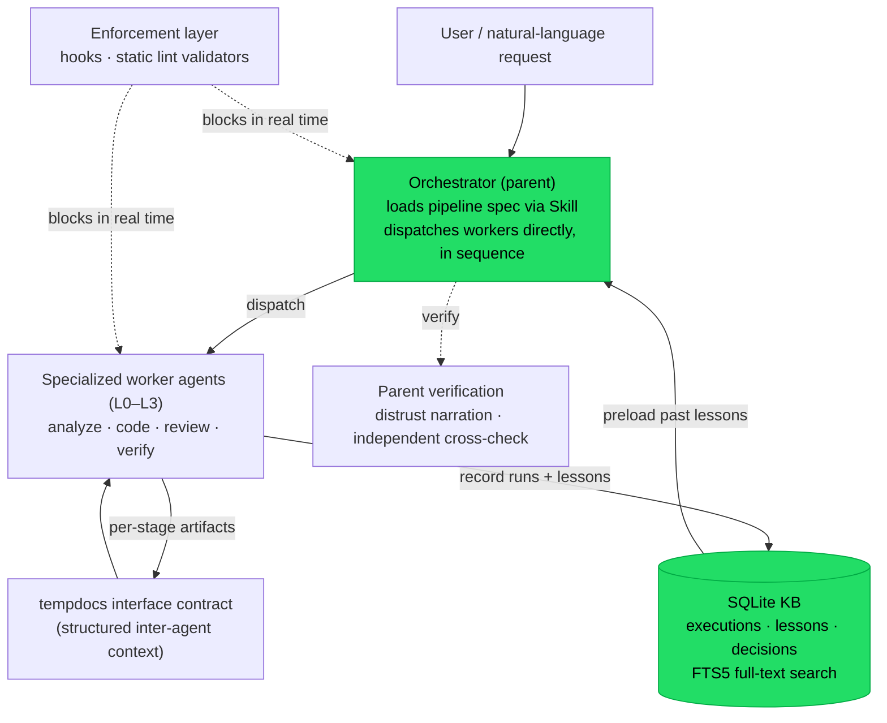
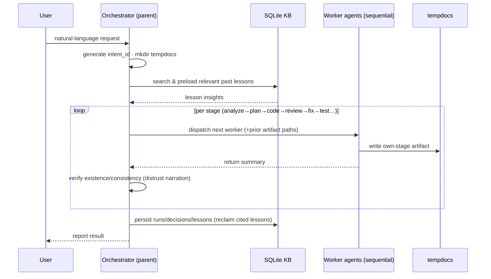

# Self-Learning Multi-Agent Development Pipeline

> **한국어: [README.md](README.md)**

> A multi-agent orchestration system I **designed, built, and operate solo** to automate development
> and operations for a production IoT platform (road-surface cooling / sprinkler control / CCTV
> streaming — a 10-service microservice monorepo). It puts LLM agents into a **real production
> development workflow** — not a demo — and **closes the learning loop**: lessons learned from past
> runs are automatically reused in new work.

---

## Table of contents
1. [TL;DR](#tldr)
2. [Verified operational metrics](#verified-operational-metrics)
3. [The problem it solves](#the-problem-it-solves)
4. [Architecture](#architecture)
5. [Pipeline catalog (22)](#pipeline-catalog-22)
6. [One run, end to end](#one-run-end-to-end)
7. [Engineering highlights](#engineering-highlights-selected)
8. [What I actually wrote](#what-i-actually-wrote-software-not-prompts)
9. [Skills demonstrated](#skills-demonstrated)
10. [Reflections — what I'd do differently](#reflections--what-id-do-differently)
11. [Scope & honesty](#scope--honesty)

---

## TL;DR

- **22 pipelines** (code development, review, architecture analysis, incident response, QA, security
  audit, DB design, …) executed by **184 specialized agents** with a defined authority hierarchy and
  artifact-ownership map.
- Every run is structured-logged into a **SQLite knowledge base (KB)**, and past lessons are
  **automatically re-cited** into new work — the system accumulates and improves on its own.
- Rules are not documentation nobody enforces — they are **enforced in real time by hooks and static
  lint** (a violation blocks execution).
- **2.5 months in operation: 968 total runs / 332 in the last 30 days (~11/day)** — a tool I use daily.

---

## Verified operational metrics

*(measured from the live KB — a 2026-07 snapshot, still growing)*

| Metric | Value | Why it matters |
|---|---|---|
| Pipelines | **22** | Covers the full dev lifecycle |
| Specialized agents | **184** | Governed by a 4-level authority model + ownership map |
| Total runs | **968** (2.5 months) | Not a demo — continuously operated |
| — of which code development | **403 (42%)** | The core of real usage is actual coding |
| Runs, last 30 days | **332** (~11/day) | Daily use |
| Lessons accumulated | **1,789** | Classified by severity and category |
| **Lesson applications (re-cited)** | **1,963** | ⭐ the learning loop actually closes |
| Decisions logged | **1,946** | Rationale is traceable |

**KB composition (1,789 lessons)** — a breakdown showing the corpus is substantive:

| Category | Count |  | Severity | Count |
|---|---|---|---|---|
| technical_insight | 461 |  | CRITICAL | 42 |
| process | 444 |  | HIGH | 251 |
| success | 438 |  | MEDIUM | 535 |
| **fabrication_pattern** | **167** |  | LOW | 45 |
| failure | 118 |  | INFO | 881 |
| bug / regression | 75 / 32 |  | | |

> The single most important number is **1,963 lesson applications.** Most "agent systems" only pile up
> logs and never reuse them. Here, what was learned in the past is **actually reused** at the start of
> new work.

---

## The problem it solves

When multiple CLI sessions and many sub-agents touch the **same codebase concurrently**, you get:
destroyed edits, untrustworthy output (agents that **fabricate** non-existent files, lines, or
fields), lost decision rationale, and the same mistakes repeated. This system controls those failure
modes structurally across **three axes: governance, verification, and learning.**

---

## Architecture

**4-level authority model** — Observer (analysis/read) · Executor (modify) · Reviewer (adjudicate) ·
Controller (flow control). Each agent's authority lives in a single frontmatter field as the source
of truth, and communication/adjudication rules derive from the level.

**Judgment is hierarchy, execution is swarm, connection is pipeline** — domain clusters (code-dev,
architecture, security, QA, …) collaborate freely internally, but cross-cluster communication is
forbidden and must go through a pipeline.

---

## Pipeline catalog (22)

| Area | Pipelines |
|---|---|
| **Build & change** | `code-dev` · `fullstack` · `dbsci-b` (schema change) · `infra` (Nginx · CI/CD · instrumentation) |
| **Understand & document** | `arch` · `arch-project` · `api-doc` (REST/WS/Kafka/BFF) · `report` · `dbsci-a` (DB optimization) |
| **Quality & safety** | `pr-review` (gates + 2-vs-2 debate) · `test` · `qa` (E2E) · `qa-doc` · `security` · `otel` (perf) |
| **Operate & recover** | `runbook` (first response) · `incident` (RCA) · `postmortem` · `feedback` (deploy-effect verification) |
| **Meta / flow** | `prompt` (intent routing) · `commit` · `todo` |

Each pipeline decomposes into 6–13 stages handled by dedicated agents (e.g. `code-dev` = preflight →
select → analyze → plan → code → review → fix → test → arch-review → close).

---

## One run, end to end

The real flow behind a single "fix this bug" request (the `code-dev` pipeline):

Three key design points: ① workers run in **isolated contexts** and the next worker reads the prior
artifact (a **worker chain** that prevents parent-context blowup); ② the parent **distrusts narration**
and cross-checks files and lines independently; ③ on completion, cited lesson IDs are auto-reclaimed
so the **reuse statistic closes the loop.**

---

## Engineering highlights (selected)

### 1. Closing the learning loop (KB)
Every run structure-logs its changed files, key decisions, and lessons into the SQLite KB. Analysis
and design agents search and cite relevant past lessons before starting, and the cited lesson IDs are
auto-scanned on completion to **reclaim re-citation statistics.**
→ Result: repeated mistakes drop, and the system gets smarter in proportion to what it accumulates.

### 2. Agent reliability engineering (fabrication mitigation)
LLM workers are **confidently wrong** — they invent files, lines, and fields that don't exist. I treat
this as a dedicated category (**167** cases accumulated in the KB) and enforce a norm of "don't trust
narration; the parent verifies independently."
→ A design that **accepts the fundamental limit** (you can't make LLMs reliable) and manages it as risk.

### 3. Redesigning the dispatch architecture (measured RCA)
The initial orchestrator ran as a sub-agent, hit a nesting limit, and **failed silently with no
output** (an "abort-tax" defect). I diagnosed it empirically and lifted orchestration up into the
parent context, making the failure **structurally impossible** to recur.

### 4. Catching doc drift in CI, not by hand (static validators)
Drift between the authority registry and the actual agent definitions is blocked deterministically by
a **TypeScript lint validator** that scans and cross-checks files (exit 1 on mismatch). A companion
script auto-splits a single SSOT document into role-scoped files and drift-checks them.

### 5. Cost measurement and model tiering
I measure token cost and allocate model tiers by task difficulty (top-tier models for hard
adjudication, lightweight models for high-volume, low-difficulty logging) and shard documents into
runtime-reference units to flatten context-load cost.

---

## What I actually wrote (software, not prompts)

- **SQLite KB schema** — FTS5 full-text search, lesson chaining, service M:N, execution/lesson/decision
  tables, schema versioning.
- **Static lint validators (TypeScript)** — frontmatter contracts, authority-registry consistency,
  doc-sync drift checks.
- **Enforcement hooks (9)** — KB path guard, rule-injection enforcement, output-completeness backfill,
  and other real-time blocking mechanisms.
- **Governance SSOT** — a rule system for authority, ownership, termination, evidence, team boundaries,
  and telemetry (cited and enforced by clause ID).
- **~40,000 lines** of agent prompts and pipeline specifications.

---

## Skills demonstrated

| Skill | Evidence in this project |
|---|---|
| **Distributed / concurrent systems thinking** | Controlling concurrent file access across many sessions/agents via ownership, locks, isolation |
| **LLM / agent orchestration** | 184 agents · 22 pipelines · hierarchical dispatch, redesigned from a measured RCA |
| **Eval & observability** | Run→lesson→re-citation loop, KB telemetry, reliability categorization |
| **Cost engineering** | Token measurement · model tiering · context sharding |
| **Developer experience / tooling** | TypeScript lint validators · enforcement hooks · SSOT auto-splitting |
| **Data modeling** | SQLite FTS5 KB schema design · versioning · migrations |
| **Systems reliability / governance** | Rules as code with real-time enforcement, fabrication risk management |

---

## Reflections — what I'd do differently

As a maturity signal, what I learned:

- **Complexity creates its own maintenance cost.** The system came to require its own lint, validators,
  and hooks just to not drift.
  → Lesson: enforcing **invariants in CI** is cheaper than adding more elaborate rules (which is why I
  built the drift validator).
- **Some governance outran the scale.** A few clauses assume a large autonomous fleet and are
  speculative at the current size.
  → Lesson: keep only rules born from problems that *actually happened*; demote the rest to rationale docs.
- **Fabrication is a management target, not something to eliminate.** Instead of stacking verification
  layers indefinitely, acknowledge the cost/benefit ceiling.

---

## Scope & honesty

- **Substrate**: the agent execution substrate is a commercial agentic CLI (Claude Code).
  My contribution is the **orchestration architecture, governance model, learning (KB) system, and
  enforcement tooling** built on top of it.
- **Scale**: designed as a **personal tool** operated by a single maintainer (not team infrastructure).
- **Known limits**: fabrication is only *mitigated* by process, not eliminated (structural). Some
  governance clauses assume a large autonomous fleet and are speculative at the current scale — an
  intentionally reserved margin.

> The point isn't sophistication for its own sake — it's that the system **actually runs, learns from
> itself, and enforces its own rules.**

---

*This document is a sanitized version with a specific employer and proprietary details removed.
Metrics are measured from the live operational KB (2026-07 snapshot).*
