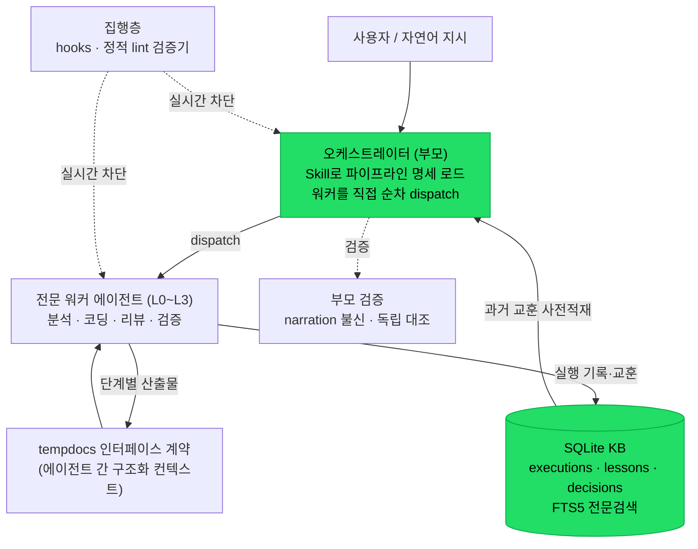
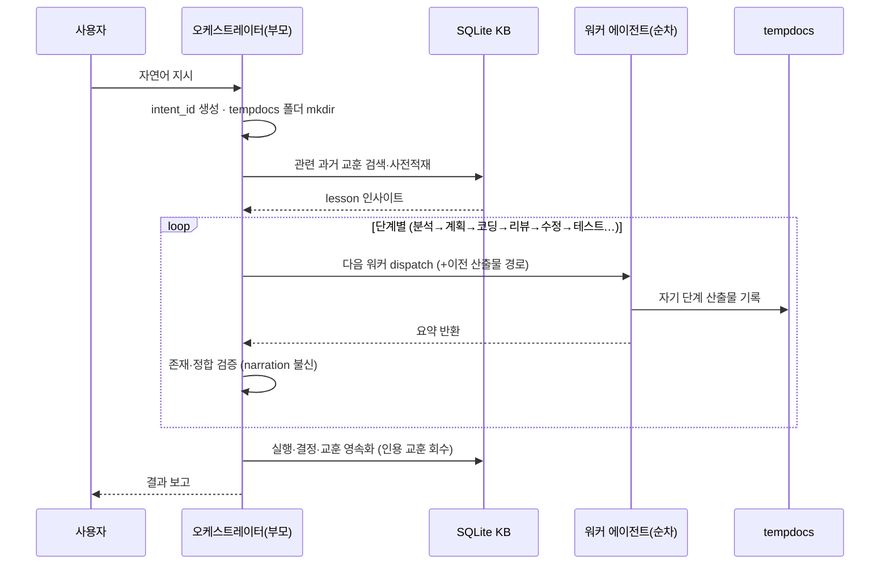

# Self-Learning Multi-Agent Development Pipeline

> **English: [README.en.md](README.en.md)**

> 프로덕션 IoT 플랫폼(도로 표면 냉각·살수 제어·CCTV 스트리밍, 10개 마이크로서비스 모노레포)의
> 개발·운영을 자동화하기 위해 **혼자 설계·구축·운영**한 멀티에이전트 오케스트레이션 시스템.
> LLM 에이전트를 "데모"가 아니라 **실제 개발 워크플로에 프로덕션 투입**하고,
> 과거 실행에서 배운 교훈이 신규 작업에 자동 재사용되는 **학습 루프를 닫은** 것이 핵심.

---

## 목차
1. [TL;DR](#tldr)
2. [검증된 운영 지표](#검증된-운영-지표)
3. [해결한 문제](#해결한-문제)
4. [아키텍처](#아키텍처)
5. [파이프라인 카탈로그 (22종)](#파이프라인-카탈로그-22종)
6. [실행 한 번의 전 과정](#실행-한-번의-전-과정)
7. [엔지니어링 하이라이트](#엔지니어링-하이라이트-선별)
8. [내가 직접 작성한 것](#내가-직접-작성한-것-프롬프트가-아니라-소프트웨어)
9. [증명하는 역량](#증명하는-역량)
10. [회고 — 다시 한다면](#회고--다시-한다면)
11. [범위와 정직성](#범위와-정직성)

---

## TL;DR

- 코드 개발·리뷰·아키텍처 분석·장애 대응·QA·보안 점검·DB 설계 등 **22개 파이프라인**을,
  권한 계층과 산출물 소유권이 정의된 **184개 전문 에이전트**로 분업 처리.
- 모든 실행이 **SQLite 지식베이스(KB)** 에 구조화 기록되고, 과거 교훈(lesson)이 신규 작업에
  **자동 재인용**된다 — 시스템이 스스로 축적·개선한다.
- 규범이 문서로만 존재하지 않고 **hook·정적 lint로 실시간 집행**된다(위반 시 실행 차단).
- 2.5개월 운영, **누적 968 실행 / 최근 30일 332건(하루 ~11건)** — 매일 쓰는 도구.

---

## 검증된 운영 지표

*(운영 KB 실측, 2026-07 스냅샷 — 계속 증가 중)*

| 지표 | 값 | 의미 |
|---|---|---|
| 파이프라인 | **22** | 개발 전 수명주기 커버 |
| 전문 에이전트 | **184** | 권한 4계층·소유권 맵으로 통제 |
| 누적 실행 | **968** (2.5개월) | 데모 아님, 상시 운영 |
| — 그중 코드 개발 | **403 (42%)** | 실사용의 중심이 실제 코딩 |
| 최근 30일 실행 | **332** (~11/일) | 일상 사용 |
| 축적된 교훈(lessons) | **1,789** | 심각도·카테고리 분류 |
| **교훈 재인용(lesson applications)** | **1,963** | ⭐ 학습 루프가 실제로 닫힘 |
| 의사결정 기록(decisions) | **1,946** | 근거 추적 가능 |

**KB 구성 (교훈 1,789건)** — 축적물이 실질적임을 보여주는 분해:

| 카테고리 | 건수 |  | 심각도 | 건수 |
|---|---|---|---|---|
| technical_insight | 461 |  | CRITICAL | 42 |
| process | 444 |  | HIGH | 251 |
| success | 438 |  | MEDIUM | 535 |
| **fabrication_pattern** | **167** |  | LOW | 45 |
| failure | 118 |  | INFO | 881 |
| bug / regression | 75 / 32 |  | | |

> 가장 중요한 숫자는 **1,963 lesson applications** 다. 대부분의 "에이전트 시스템"은 로그만 쌓고
> 재사용하지 않는다. 여기서는 과거에 배운 것이 신규 작업 시작 시점에 **실제로 다시 활용**된다.

---

## 해결한 문제

여러 CLI 세션과 다수 서브에이전트가 **동일 코드베이스를 동시에** 만질 때 발생하는 문제 —
서로의 변경 파괴, 신뢰할 수 없는 산출물(존재하지 않는 파일·라인·필드를 지어내는 fabrication),
결정 근거의 소실, 반복되는 동일 실수 — 를 **거버넌스·검증·학습 세 축**으로 구조적으로 통제한다.

---

## 아키텍처

**4계층 권한 모델** — Observer(분석/읽기) · Executor(수정) · Reviewer(판정) · Controller(흐름제어).
각 에이전트의 권한은 frontmatter 단일 필드가 SSOT이며, 통신·판정 규칙이 계층에서 파생된다.

**판단은 계층, 실행은 군집, 연결은 파이프라인** — 도메인 클러스터(코드개발·아키텍처·보안·QA…)는
자유롭게 협업하되 클러스터 간 직접 통신은 금지되고 반드시 파이프라인을 경유한다.

---

## 파이프라인 카탈로그 (22종)

| 영역 | 파이프라인 |
|---|---|
| **구축·변경** | `code-dev` · `fullstack` · `dbsci-b`(스키마 변경) · `infra`(Nginx·CI/CD·계측) |
| **이해·문서화** | `arch` · `arch-project` · `api-doc`(REST/WS/Kafka/BFF) · `report` · `dbsci-a`(DB 최적화 분석) |
| **품질·안전** | `pr-review`(게이트+2:2 디베이트) · `test` · `qa`(E2E) · `qa-doc` · `security` · `otel`(성능) |
| **운영·복구** | `runbook`(1차 대응) · `incident`(RCA) · `postmortem` · `feedback`(배포효과 검증) |
| **메타·흐름** | `prompt`(의도 라우팅) · `commit` · `todo` |

각 파이프라인은 6~13단계로 세분되어 전용 에이전트가 담당한다(예: `code-dev` = 사전점검→선정→
분석→계획→코딩→리뷰→수정→테스트→아키텍처검토→완료처리).

---

## 실행 한 번의 전 과정

"이 버그 고쳐줘" 한 마디가 처리되는 실제 흐름 (`code-dev` 파이프라인):

핵심 설계점 세 가지: ① 워커는 **격리 컨텍스트**에서 일하고 다음 워커가 이전 산출물을 읽는
**워커 체인**(부모 컨텍스트 폭발 방지) ② 부모는 **narration을 믿지 않고** 파일·라인을 독립 대조
③ 종료 시 인용된 교훈 ID가 자동 회수되어 **재사용 통계가 닫힌다**.

---

## 엔지니어링 하이라이트 (선별)

### 1. 학습 루프를 닫다 (KB)
실행마다 변경 파일·핵심 결정·교훈을 SQLite KB에 구조화 기록. 분석/설계 에이전트는 작업 시작 전
관련 과거 교훈을 검색·인용하고, 인용된 교훈 ID는 종료 시 자동 스캔되어 **재인용 통계로 회수**된다.
→ 결과: 동일 실수의 반복이 줄고, 시스템이 축적한 만큼 똑똑해진다.

### 2. 에이전트 신뢰성 공학 (fabrication 완화)
LLM 워커는 **확신에 차서 틀린다** — 없는 파일/라인/필드를 지어낸다. 이를 별도 category로 취급해
**167건**을 KB에 축적하고, "narration을 신뢰하지 말고 부모가 독립 검증"하는 규범을 강제했다.
→ 에이전트를 신뢰 가능하게 만들 수 없다는 **본질을 인정**하고, 리스크 관리로 접근한 설계.

### 3. dispatch 아키텍처 재설계 (실측 RCA)
초기 오케스트레이터가 서브에이전트로 실행되며 nesting 제한에 걸려 **산출물 없이 조용히 실패**하는
결함(abort-tax)을 실측으로 진단하고, 오케스트레이션 주체를 부모 컨텍스트로 끌어올려
**구조적으로 재발 불가능**하게 재설계했다.

### 4. 문서 drift를 손이 아니라 CI가 잡게 (정적 검증기)
권한 레지스트리가 실제 에이전트 정의와 어긋나는 drift를, 파일 스캔·교차대조하는 **TypeScript lint
검증기**로 결정론적으로 차단(불일치 시 exit 1). 단일 SSOT 문서를 역할별 파일로 자동 분할·동기화
검사하는 스크립트도 함께 운영.

### 5. 비용 계측·모델 티어링
토큰 비용을 실측하고 작업 난이도에 따라 모델 티어를 배분(고난도 판정은 상위 모델,
고volume·저난도 기록은 경량 모델). 문서를 런타임 참조 단위로 분할해 컨텍스트 로드 비용을 평탄화.

---

## 내가 직접 작성한 것 (프롬프트가 아니라 소프트웨어)

- **SQLite KB 스키마** — FTS5 전문검색, 교훈 체이닝, 서비스 N:M, 실행/교훈/결정 테이블, 스키마 버저닝.
- **정적 lint 검증기 (TypeScript)** — frontmatter 계약·권한 레지스트리 정합·문서 동기화 드리프트 검사.
- **집행 hooks (9종)** — KB 경로 가드, 규칙 주입 강제, 산출물 완결성 보정 등 실시간 차단 장치.
- **거버넌스 SSOT** — 권한·소유권·종료·증거·팀경계·텔레메트리 규칙 체계(조항 ID로 인용/집행).
- **~40,000줄** 규모의 에이전트 프롬프트·파이프라인 명세.

---

## 증명하는 역량

| 역량 | 이 프로젝트에서의 근거 |
|---|---|
| **분산·동시성 시스템 사고** | 다중 세션·다중 에이전트의 동시 파일 접근을 소유권·락·격리로 통제 |
| **LLM/에이전트 오케스트레이션** | 184 에이전트·22 파이프라인·계층형 dispatch, 실측 RCA로 재설계 |
| **평가·관측성(Eval/Observability)** | 실행→교훈→재인용 루프, KB 텔레메트리, 신뢰성 카테고리화 |
| **비용 엔지니어링** | 토큰 계측·모델 티어링·컨텍스트 샤딩 |
| **개발자 경험/툴링(DX)** | TypeScript lint 검증기·집행 hooks·SSOT 자동 분할 |
| **데이터 모델링** | SQLite FTS5 KB 스키마 설계·버저닝·마이그레이션 |
| **시스템 신뢰성/거버넌스** | 규범의 코드화와 실시간 집행, fabrication 리스크 관리 |

---

## 회고 — 다시 한다면

성숙도의 신호로, 알게 된 것들:

- **복잡도는 자기 유지비용을 만든다.** 시스템이 안 깨지려고 자체 lint·검증기·hook을 요구하게 됐다.
  → 교훈: 정교한 규칙을 늘리기보다 **불변식을 CI로 강제**하는 편이 값싸다(그래서 drift 검증기를 만들었다).
- **일부 거버넌스는 규모를 앞섰다.** 대규모 자율 함대를 상정한 조항 일부는 현재 규모엔 선제적이다.
  → 교훈: "일어난 문제"만 규범으로 남기고, 나머지는 근거 문서로 강등.
- **fabrication은 근절이 아니라 관리 대상.** 검증 층을 무한히 쌓는 대신 비용 대비 효과의 상한을 인정.

---

## 범위와 정직성

- **기반**: 에이전트 실행 substrate는 상용 agentic CLI(Claude Code)다.
  나의 기여는 그 위에 올린 **오케스트레이션 아키텍처·거버넌스 모델·학습(KB) 시스템·집행 도구**다.
- **규모**: 단일 유지보수자가 운영하는 **개인 도구**로 설계됐다(팀 인프라 아님).
- **알려진 한계**: fabrication은 프로세스로 완화될 뿐 근절되지 않는다(구조적). 일부 거버넌스 조항은
  대규모 자율 함대를 상정한 것으로, 현재 규모엔 선제적(speculative)이다 — 의도적으로 남긴 여지.

> 정교함 자체가 아니라 **"실제로 돌아가고, 스스로 배우고, 규범이 집행된다"** 가 이 프로젝트의 요지다.

---

*본 문서는 특정 고용주·독점 정보를 제외한 sanitize 버전이다. 지표는 실제 운영 KB에서 측정한 값이다(2026-07 스냅샷).*
